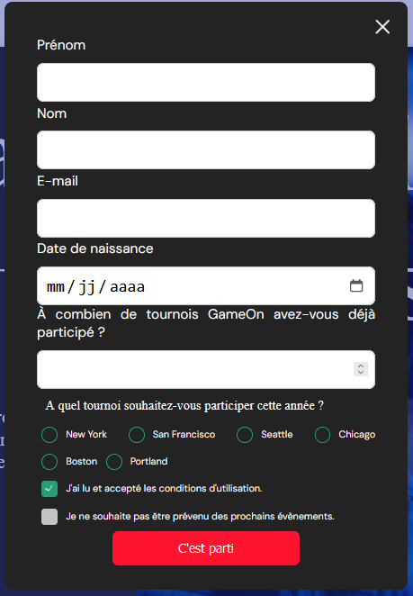
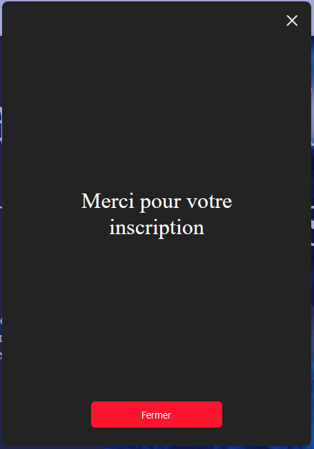

# GameOn

=======

  
  

Projet 4 de la formation "Concepteur Développeur d'application JavaScript / REACT" chez OpenClassrooms.

## Table des matières

- [Objectifs](#objectifs)
- [Issues à réalisées](#issues)
- [Technologies](#technologies)
- [Liens](#liens)

## Objectifs

L'objectif consiste à ajouter le code JavaScript manquant pour que le formulaire soit pleinement fonctionnel.

Nous avons reçu quelques commentaires de la part de l’équipe de QA récemment, donc lorsque tu soumets ton code, assure-toi de :

1.  Travailler sur un repo GitHub forké ;
2.  Utiliser des fichiers séparés pour le HTML, le CSS et le JavaScript ;
3.  Toujours commenter ton code (décrire chaque fonction et chaque classe, ainsi que les parties du code qui nécessitent plus de détails) ;
4.  Tester manuellement les fonctionnalités, les entrées de formulaire et l'affichage responsive.

## Issues à réalisées

    ### TODO : fermer la modale #1

        Ajouter la fonctionnalité au bouton (x)

    ### Implémenter entrées du formulaire #2

        (1) Lier les labels aux entrées dans le HTML en utilisant les attributs "for" et "id" dans le code existant. Corriger le code HTML quand nécessaire.
      (2) Utiliser du JavaScript pur (pas de jQuery) pour terminer le       formulaire :

    Le formulaire doit être valide quand l'utilisateur clique sur "Submit"
    Les données doivent être saisies correctement :
    (1) Le champ Prénom a un minimum de 2 caractères / n'est pas vide.
    (2) Le champ du nom de famille a un minimum de 2 caractères / n'est pas vide.
    (3) L'adresse électronique est valide.
    (4) Pour le nombre de concours, une valeur numérique est saisie.
    (5) Un bouton radio est sélectionné.
    (6) La case des conditions générales est cochée, l'autre case est facultative / peut être laissée décochée.
    Conserver les données du formulaire (ne pas effacer le formulaire) lorsqu'il ne passe pas la validation.

    ### Ajouter validation ou messages d'erreur #3

        Des messages d'erreur spécifiques doivent apparaître sous l'entrée qui n'est pas correcte. Les messages d'erreur doivent s'afficher sous le champ de saisie associé. Exemples :

    "Veuillez entrer 2 caractères ou plus pour le champ du nom."
    "Vous devez choisir une option."
    "Vous devez vérifier que vous acceptez les termes et conditions."
    "Vous devez entrer votre date de naissance."

    ### Ajouter confirmation quand envoi réussi #4

        Après une validation réussie, inclure un message de confirmation de la soumission réussie pour l'utilisateur (ex. "Merci ! Votre réservation a été reçue.")

    ###  Tests manuels #5

      1. Visualiser et tester l'interface utilisateur dans les dernières versions de Chrome et de Firefox, ainsi que dans les versions mobile et desktop. Corriger les erreurs d'affichage existantes.
      2. Tester toutes les fonctionnalités des boutons et des entrées de formulaire (tester les valeurs correctes et incorrectes)

## Technologies

Autorisées : HTML / CSS / JavaScript

## Liens

- [Maquettes mobile et desktop du site GameOn](https://www.figma.com/design/B7NKBDvSI18uoMLJgpnh48/UI-Design-GameOn-FR?node-id=106-630&t=MaM8NCylgRbPovsL-0)
- [Issues à réalisées](https://github.com/OpenClassrooms-Student-Center/GameOn-website-FR/issues)
- [Déploiement](https://gregmelo.github.io/GameOn-website-FR/)
- [Présentation] En Cours de réalisation
