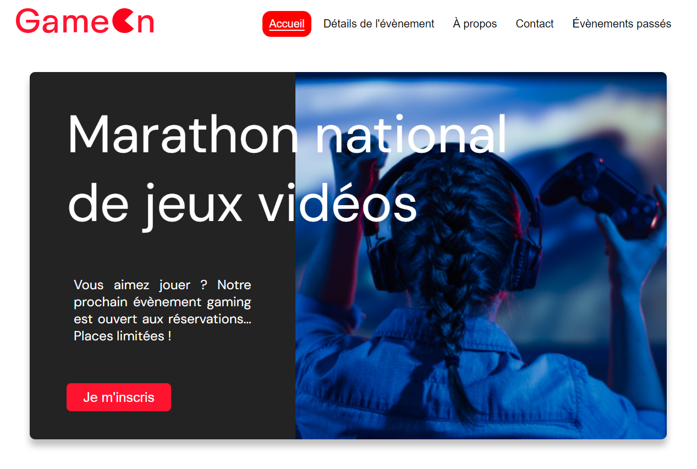

# GameOn

Projet 4 du parcours "**Développeur d'application - JavaScript React**" chez [OpenClassroom](https://openclassrooms.com/fr/).

Créez une landing page avec Javascript

## Description

Vous avez récemment été embauché comme développeur Front-End junior dans une PME, GameOn, spécialisée dans les conférences et les concours de jeux.

Votre travail consiste à résoudre les issues qui ont été relevé.

## Tester

Vous pouvez tester directement l'application [ici](https://code9g.github.io/GameOn/)

>)

